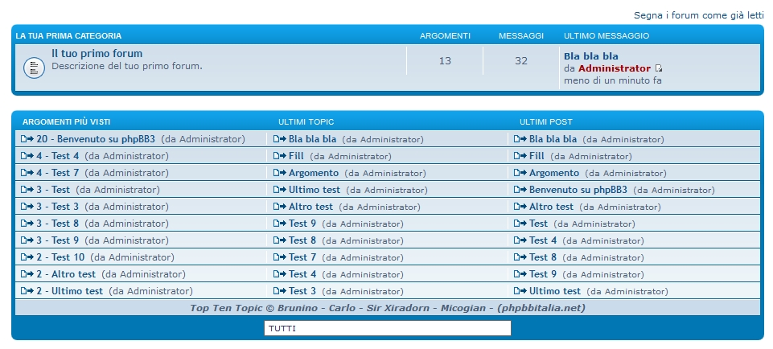

Top Ten Topics for phpBB 3.1
============

Extensione per phpBB 3.1 per mostrare gi ultimi argomenti, post e gli argomenti più visti in una comoda classifica.  
Un menu permette poi di fare un filtraggio dei contenuti.
*Questa Estensione è il porting della MOD creata da Micogian*

##### Basata sulla mod creata da Micogian per phpBB 3.0.X

## Caratteristiche
- * da aggiungere *

#### Requisiti
- phpBB 3.1.0 or higher
- PHP 5.3.3 or higher

#### Lingue
- Italiano
- Inglese
- Tedesco

## Installazione
1. [Scarica l'ultima release](link) e estrai il contenuto.
2. Copia l'intero contenuto nella cartella `/ext/staffit/toptentopics/`.
3. Naviga nel PDA to `Customise -> Manage extensions`.
4. Trova `Top Ten Topics` in "Estensioni Disabilitate" e clicca su `Abilita`.

## Disinstallazione
1. Naviga nel PDA fino a `Personalizza -> Gestisci Estensioni`.
2. Clicca `Disabilita` sulla estensione in questione.
3. Per una cancettazione permanete, clicca su `Elimina Dati`, quindi cancella la cartella `toptentopics`.

### License
[GNU General Public License v2](http://opensource.org/licenses/GPL-2.0)

© 2015 
- Brunino - Developer
- Micogian - Creator and Helper
- Sir Xiradorn - Designer
- Carlo - Coding Helper