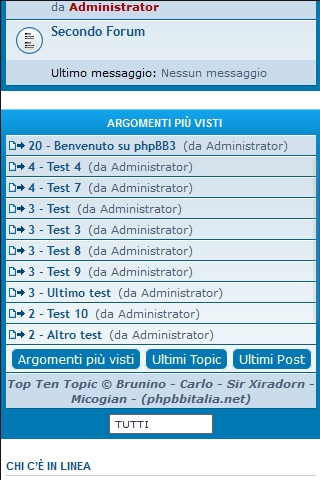

Top Ten Topics for phpBB 3.1
============

Extensione per phpBB 3.1 per mostrare gi ultimi argomenti, post e gli argomenti più visti in una comoda classifica.  
Un menu permette poi di fare un filtraggio dei contenuti.  
*Questa Estensione è il porting della MOD creata da Micogian*

`Desktop Version`

`Mobile Version`

##### Basata sulla mod creata da Micogian per phpBB 3.0.X
  
============
  
## Caratteristiche
- Possibilità di scegliere la posizione del box con le seguenti opzioni
  - Prima della lista dei forum e del link "segna come già letti"
  - Prima della lista dei forum, ma dopo link "segna come già letti"
  - Dopo la lista dei forum e del box di login
  - Dopo la lista dei forum, ma prima del box di login
  - In tutte le pagine, nel footer

- Scelta del numero di post mostrati

- Possibilità di mostrare o meno il box agli Ospiti

- Scelta del periodo predefinito che appare appena la pagina e il box vengono caricati
  - ultimo mese
  - ultimi 3 mesi
  - ultimi 6 mesi
  - ultimi 12 mesi
  - Tutti

- Scegli quali tipi di topic visualizzare
  - Solo topic normali
  - Topic normali e importanti
  - Topic normali, importanti e annunci
  - Topic normali, importanti, annunci e annunci globali

- Possibilità di escludere alcune sezioni tramite il loro ID

#### Requisiti
- phpBB 3.1.0 or higher
- PHP 5.3.3 or higher

#### Lingue
- Italiano
- Inglese
- Tedesco
- Arabo

## Installazione
1. [Scarica l'ultima release](link) e estrai il contenuto.
2. Copia l'intero contenuto nella cartella `/ext/staffit/toptentopics/`.
3. Naviga nel PDA e recati in `Personalizzazioni -> Gestione estensioni`.
4. Trova `Top Ten Topics` in "Estensioni Disabilitate" e clicca su `Abilita`.

## Disinstallazione
1. Naviga nel PDA fino a `Personalizzazioni -> Gestione estensioni`.
2. Clicca `Disabilita` sulla estensione in questione.
3. Per una cancettazione permanete, clicca su `Cancella i dati`, quindi cancella la cartella `toptentopics`.

### License
[GNU General Public License v2](http://opensource.org/licenses/GPL-2.0)

© 2015 
- Brunino - Developer
- Micogian - Creator and Helper
- Sir Xiradorn - Designer
- Carlo - Coding Helper